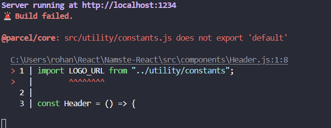
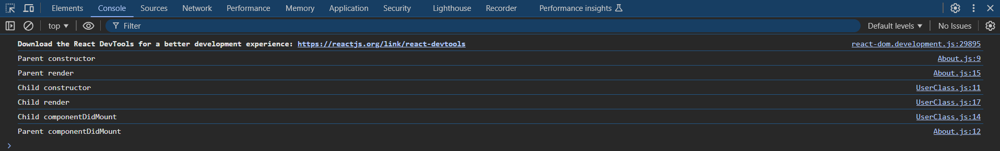

# Episode - 2

- Parcel :-

  Parcel is a dependency which comes with the npm package it genrally help us to bundle our code to make it production or development ready.

  Bundling is very important because we wrote code in different format like JS, HTML, CSS to minify our code bundling is very important, parcel is doing job for us in the process of minifying.

  npm install -D parcel

  This command is installing parcel for us, while -D is showing its Dev or Development Dependency.

  Parcel will create a server to host our application

  This command is used to build a application for developement purpose { npx parcel index.html }
  This command is used to build a application for developement purpose { npx parcel build index.html }

- DEV Dependency and Normal Dependency :-

  The Dev Dependecy are the dependecy which is used in our local to run the application with a set of packages.

  The Normal Dependency are the production Dependency which goes with our code to run in production.

- Dependecy and pacakges are different name but refers to same thing like when we install any npm package either we call it
  dependency or package

- Package.json :-

  package.json is a configuration file for npm and it contains all the dependencies with it version number

- ^ caret and ~ tilde -

  "devDependencies": {
  "parcel": "^2.12.0"
  }

  ^ this is a caret symbol which help us automatically upgrade the minor whenever its going to release. suppose currently 2.12.0 later it will automatically upgrades to 2.12.1 or something which gonna release.

  While ~ tilde symbol will upgrade dependency with major version.suppose currently 2.12.0 later it will automatically upgrades to
  3.0.0 or something which gonna release.

* Package-lock.json :-

  package-lock is genrally maitains the exact version of the dependency as well hashing or integrity so that production as well as on local have same kind of or same version dependency while using the hashing

- node_modules :-

  node_modules folder is like a database which contains all packages with its package dependecy with actual codebase

# Parcel

- Dev Build
- Local Server
- HMR = Hot Module Replacement
- File Watching Algorithm - written in C++
- Caching - Faster Builds
- Image Optimization
- Minification
- Bundling
- Compress
- Consistent Hashing
- Code Splitting
- Differential Bundling - support older browsers
- Diagnostic
- Error Handling
- HTTPs
- Tree Shaking - remove unused code
- Different dev and prod bundles

# ----------------------------------------------------------------------------------------------------------------------------------------

# Episode : -3

# JSX

We rendered a react element for HTML tag using a React.createElement but when number of lines increases in code then it become difficult to uderstand what we wrote it does not give as proper visibility and debugging of our code.

To make our life easier JSX comes in a picture.

const heading = React.createElement("h1", { id: "heading" }, "Namste React");

const jsxHeader = <h1 id="heading">Namste React</h1>;

This a simple jsx code.

- JSX is not a HTML
- JSX is not a React
- JSX is writtern by META developers to make our life easier to wirte HTML/XML like syntax.

If we try to print both heading and jsxHeader on console it will print a same object, because we are using a parcel to build our React code to compile and transpile to JS.

Behind the scene Parcel is dependent on babel which is open source library do all compilation and Traspile of our code.

When we try simply run a JSX on a browser console we can't run it because it is not a actual Javascript.

Now Babel come in picture, Now Babel is converting a JSX code to React.CreateElement then HTML tag,
That is the reason both heading and jsxHeading printing the same object on console.

const jsxHeader = (

  <div>
    <h1 id="heading">Namste React</h1>
    <h2> Hello</h2>
  </div>
);

For multi line expression of JSX code it must be enclosed with in bracket.

# Package.json

In Package.json "Scripts" are the best place to store our commands to run our project.

"start" : "npx parcel index.html"

In this way we can store all commands for dev, production as well as other enviornments,
In scripts here we can add all necessary commands to run our project.

npm run start and npm start both are same.

if we want to run any script command just write

npm run scriptKey

script key is like start, test, build.

# Components

Everyting in React is component suppose if want to build a button or card or anything we will create it as a component.

Component name always start with Capital letter with Suffix at the is Component.
for eg :- HeaderComponent

Their are two type of components :-

- Functional Component
- Class Component

Functional Component :-

Functional Component is a simple Javascript function that return JSX.

Function Component can be used as JS arrow function or JS Normal function.

If we want to add any outside JSX expression inside our Functional component JSX code then we can use {} this brackets.
we can add the outside JSX variable in the curly braces.

{} This is powerful brackets to use inside JSX, we can perfom any Javascript code here inside JSX.

JSX is powerful thing it sanitize all the data we are passing into it. JSX performs checks on data weather it is malicous or good. Then
it send to browser.

To use Function component we use angular brackets

<HeaderComponent /> OR <HeaderComponent><HeaderComponent />

# --------------------------------------------------------------------------------------------------------------------------------------

# Episode 4

# Component Compisition :-

Component Compisiton means we are using one component in another component.

# Config Driven UI :-

Config Driven UI means our UI is changing dynamically according to our backend data.
For ex :- swiggy has different offer carousel for different city like Mumbai and Delhi could have different carousel offers and Indore don't have carousel offer.
Basically we are building website once it changing or reacting according to the backend data for different conditions.

# props :-

Props is a property on a component, in simpler terms we can say a argument to a function at the end component is a javascript function.
To change data dynamically to a component we use a conecpt of props in React.

<RestaurantCardComponent
            key={restaurant.data.id}
            resData={restaurant}
          />

resData is prop we are passing to a component, resData is containing refrence to resturant object.

# key :-

key is a reserved keyword in react, which is used whenever we perform a loop operation on array, it is a good pratice to give a unique key to our dynamically rendered components.

Key is powerfull concept, suppose new item is added to a list and if have not provide a key to our component then it basically re-render whole list because react not able to identify where to put the newly added component on a dom because all child of root node are at the same level. Basically Key is saving us for bad experince because if unique key is present than react automatically identify it's place put the newly added component.

If unique is not coming from backend, then must add in api, if still backend does not have unique key than we can use array index as key. But it is a bad practice.
https://legacy.reactjs.org/docs/lists-and-keys.html
https://robinpokorny.com/blog/index-as-a-key-is-an-anti-pattern/

# Food App

/\*\*

- Header
- - Logo
- - Nav Items
- Body
- - Search
- - RestaurantContainer
- - RestaurantCard
-      - Img
-      - Name of Res, Star Rating, cuisine, delery tie
- Footer
- - Copyright
- - Links
- - Address
- - Contact
    \*/

# -------------------------------------------------------------------------------------------------------------------------------------

# Episode 5

# Export and Import

Export & Import is very important concept in React, This concept comes in picture when we want to use a one component in another component or any constants or utilites we want to use in another file.

If want to use component or utility in another file first we export than we import in another file to use an exported thing.

Their is two type of exports.

1.  Default export.
2.  Named export.

3.  Default export is a export we directly use with default keyword, means in the file only one thing need to export so we give it as same name weather it is component or constant.

For eg :-

export default Restaurant;

If we are giving it as default than we don't need to includ in curly braces while importing in another file.

import Restaurant from "./RestaurantCard";

2. Named Export :-

Named export is used when we want to export more than one thing from same file. we use export in front of declaration of function or constant so that while importing with name conflict does not occur.

If we are using Named export then we must include imported thing in curly braces else we will get an error.

export const LOGO_URL =
"https://www.logodesign.net/logo/smoking-burger-with-lettuce-3624ld.png?size=2";

import { LOGO_URL } from "../utility/constants";



# Hooks

In React Hooks are a Javascript funtions which gives a react more power in terms of fast DOM manipulation, State Managements etc.

# useState Hook :-

Suppose we are rendering a component which has list of resturants, when our app start whole list is rendered on UI, But after we click on filter button or we can say an onClick event is occurred and filtered the list but UI is not changed.

Then state management comes in picture. useState Hook help us to maintain sync between data and UI.

useState Hook is most useful when some event occur due to data changed to provide sync between UI and data layer useState help.

useState re-renders the component when data is changed.
That is the reason it make React faster only component is re-renders not whole app.

# Reconcilation OR React fiber OR Virtual DOM.

Whenever any re-renders happens their not magic going on, React has virtual Dom and Diff algorithm which keeps track or DOM Nodes.

For example Initally in our app one component renders 7 resturant list details but after click filter butter resturants became only 4.

So basically our acutal dom has 7 nodes but now its 4 and this 4 nodes is a virtual DOM. React Diff compares the actual Dom and Virtual Dom calculate the difference then re-renders the components.

Virtual DOM :-

We know that React.createElemet give us a object. whenever the component changes new object will create, component and React.createElement is same at the end it is JS object.

Our orignal object and new object is actual dom and virtual dom, React Diff algo compares this two obj and re-renders the component.

Because comparing an HTML document is difficult than objects.

# --------------------------------------------------------------------------------------------------------------------------------------

# Episode : 6

Shimmer UI :-

This is very good concept in terms of providing a good user experince to customers,

Tradition concept is we can provide a spinner util the data is fetched from API, But this gives a bad UX because suddenly users will see a huge data on page.

Shimmer provides a good UX by using a fake data, suppose we want to display a list of cards we will show the fake cards to the user until the orignal comes from the API. Shimmer sets a mentallity of user that something is coming on page related to his work.

for demo eg:- Shimmer.js I created.

Rendring On API call :-

Their are two types of Rendering are used in fronted when API is called.

1. UI -> API -> Render
2. UI -> Render -> API -> Render

Second option is good in terms of providing a good UX because if use first user have to wait some time on page to see the actual data, until that either page is loding or spinner use will get.

In second we use the shimmer concept until our API fetched the data until then shimmer will show the fake or dummy page to user that some related content is coming.

# useEffect Hook :-

UseEffect hook in React is very important when we use second approach for render the UI or component.

This Hook is called once the component is rended this Hook is called. This Hook is very useful to fetch api data in rendering cycle.

useEffect(() => {

}, [])

This hook takes two parametes

1. callback function
2. Dependecy array

#------------------------------------------------------------------------------------------------------------------------------------

# Episode 7

Routing:- https://reactrouter.com/en/main/hooks/use-params

#-------------------------------------------------------------------------------------------------------------------------------------

# Episode 8

Class Component :-

Earlier in starting era of React their is no one uses the functional component, functional component is latest feature or way of writing the components in react.

But in industry still some legacy projects are running on the class based components its very important to understand this concept or another way of writing the component.

```
import React from "react";

class UserClass extends React.Component {
  constructor(props) {
    super(props);
    this.state = {
      count: 0,
      count1: 1,
      count2: 2,
    };
  }
  render() {
    let { count, count1, count2 } = this.state;
    return (
      <div className="user-card">
        <h1>{count}</h1>
        <button
          onClick={() => {
            this.setState({ count: count + 1 });
          }}
        >
          Increase count
        </button>
        <h4>Name : {this.props.name}</h4>
        <h4>Location : {this.props.location}</h4>
        <h4>Mode : {this.props.mode}</h4>
      </div>
    );
  }
}

export default UserClass;
```

- Here we wirte our whole component inside the JS class which extends the React.Component class.
- React.Component class enables and gives the power to us use the react features to write component.
- React.component is provided the render method which we overrides to write our JSX code.
- To pass the props in class component we use the constructor to play with the properties inside costructor we are passing props in super constructor or basically in the react.component class.

why we are passing props to super google it🤣🤣🤣🤣🤣🤣🤣 for better learnings.

In Functional component to manage the state we uses the useState hook, But in class component we are using the this.state variable to play or manage the state in component.

this.state = {
count: 0,
count1: 1,
count2: 2,
};

- this.state is a big object which contains all the state varibles to manage the state.
- this.state vairable is always is used inside the constructor why will discuss later or below in some points.
- to set the state variable we don't directly update the values or keys of the the object.
- to update the state variables we have setState methode which we will use and pass JS object with state variable and update value like this

* when we are updating count it only update the count state variable won't touch any other variable in this.setstate.

````
<button
  onClick={() => {
    this.setState({ count: count + 1 });
  }}
>
```
* this.state.count += 1 is a wrong way of updating the value, react will not able to identify dom changes.

Why we are using this.state always in constructor?

Ans :- When we are calling a functional component in web page mean react are mounting it in web page, similarly when ever we are using a class based component react is creating a object for us to use in the web page.
when object is created a constructor is called so, basically we can do all initialization here because it's best place.


````

# Lifecycle of class based component :-

In class based component first constructor is called then render method then componentDidMount method.

If their is a parent child relation in class based component then the flow will change for parent class based component.



Code reference is available in About.js and UserClass.js file.

ComponentDidMount is very useful to make API call. If we recall functional component their we used useEffect hook because it called after the component is rendered afer making an api call it fills data in component and re-render it.

UI -> Render -> API -> Render

So componentDidMount method is helping us making api calls like this.

Suppose if we have multiple child class based compnent then Lifecycle is now different.

1. constructor will be called of parent class.
2. Render Method will be called of parent class.
3. constructor will be called of first child.
4. Render will be called of first child.
5. constructor will be called of second child.
6. Render will be called of second child.
7. If multiple child are their then constructor and render will be calleds of child and so on....
8. ComponentDidMount will be called of first child.
9. ComponentDidMount will be called of second child.'
10. ComponentDidMount will be called of parent child.

Why this parent did ComponentDidMount of first child is called after the second child constructor and render method.

Ans :- React optimizes the object creation process and render process, it batches all the object in render phase.

For More info visit here https://projects.wojtekmaj.pl/react-lifecycle-methods-diagram/

Update cycle begin once setState method is called.

Never compare lifecycle of class component with functional because its an older way of writing the component, but functional component made the developer life easy and we don't have bother about the lifecycle in functional component Mounting and Unmounting phase.

# --------------------------------------------------------------------------------------------------------------------------------------

# Episode 9

# Single Responsiblity Principal :-

Code is Just Piece of line any one can write. But to become a good developer we must follow certain rules which helps us to create an impcat among the end users.

One of the finest and greates rule is SRP.

SRP help us to make our code more readable, maintainble, testable, resuable.

1. Readable :- If make our component in react light and modular then we will easily read and debug the code.
2. Maintainable :- If we make our component light small we easily maintain and add the new feature accordingly.
3. Testable :- If our component follow SRP we can esily test it find the bug.
4. Reusable :- If our component follow SRP we can easily reuse it anywhere.

SRP means :- For ex our component is doing rendering and fetching the data and some how we can break this two functionally and write the logic single single or basically some how we can separte the functionallity from each other to make our code more readable, maintainble, testable, resuable.
To follow SRP in React component their are multiple ways but one of the the good ways is to use custom hook.

Here to make our component to follow SRP custom hooks comes in picture.

# Custom Hooks :-

Hooks are Just normal JS function which react gives us to use without worrying about the inner implemantation. In react we can make our own hooks which we will use it as per our need.

To write custom Hook always start a Hook name with use which help react and devloper to understand that this is hook or utility which is doing something behing the secne for us.

# Optimization or Lazy Loading :-

We explored parcel previously, its job is to bunddle the application or provide the production ready file.
Suppose if we have big application with thousands of components like make my trip.
we can't bunddle whole application in one single file index.js but we can do something like chunking or or divide the app big component into smaller chunks or lazy load that components.

Lazy Loading helps us to load the file whenever make call to that component feature.

For ex :- Swiggy has two buisness one is food delivery & instamart.

if we load the instamart with food delivery feature in browser our app becomes heavy and index.js size is much greater that leads swiggy perfomance issue.

insted we could something like lazy loding or dynaminc loading. This concept will help us to create a seprate bunddle file for each big feature and load this bunddle file in the browsers as the use made the call for requested feature.

This concept looks simple it has huge impact on our main index.js file to make light weight and load this file in browser by react very fast at the starting of application.

For the use Lazy loading we are doing code sepration.

```
const Grocery = lazy(() => import("./components/Grocery"));

{
        path: "/grocery",
        element: (
          <Suspense fallback={<div>Loading...</div>}>
            <Grocery />
          </Suspense>
        ),
}
```

lazy function is help us to dynamically load the component as required without bunddle it with whole application.
here lazy takes a callback function and use an import function to import the required component.

<Suspense> component is provided by react to help developers to make good UX for clients or world by not showing useless thing, This gives us power that we can wait until the lazy loaded bunddle file is not loaded we can show user that component is loading or shimer UI comonent in fallback until or requested bundle is not loaded in browser.

# ------------------------------------------------------------------------------------------------------------------------------------

# Episode 10

# Jo Dikhta h voh bikta hai

Eariler in frontend we are using many ways to use css either by writing our self or by using some built in libraries.

we can wirte css using mulitiple way like

1. Traditional CSS
2. SCSS
3. Material UI
4. Boot strap
   and many more ways

But Now days tailwind is most popular and super power ful css library.

pros :-

1. Tailwind provides a css classes, so that we can directly use in our HTML, JSX to make use UI good.
2. Tailwind provides the concept of reusablity, suppose if we are using one tailwind class multiple time in our project it when we build the project bundler only contains only one time the build of that class. That makes tailwind most popular because of light weight.

cons :-

2. Tailwind intial learning curve is little bit time consuming, but once we are used to it makes our life much much easier.
3. Tailwind class makes our code ugly because lot of thing in one place.

Go to offical documentation for the learning and to explore more about tailwind.

Install vs code extension for tailwind

1. PostCSS Language Support
2. Tailwind CSS IntelliSense

# --------------------------------------------------------------------------------------------------------------------------------------

# Episode 11

Higher order level component :-

Higher Order level component is function which takes value as component and return a component. Higer order level component is just a JS function, which add a extra feature to existing component with disturbing its acutal implementation. Higher order level function/component so we can say a pure functions also.

Data Mangement using Accordian :-

Accordian is just css feture to collapse and expand to show and hide the data but the main problem is the manage the state of data so its good concept of using accordian to manage the state of data when it open data must visible and when accordian is collapse it data must be hide.

Lifitng state Up & (controlled And Uncontrolled component) :-

- Uncontrolled componets are functions on parent component has no control on his children component's state variables. It's just like childeren component has contains its own state varible and manage by their own.

- Controlled component are the functions are the components wheir childeren components are depends on the parents state varibles, Basically parent component control the state of its childerent comonent.

- Lifting state up basically parent component will send the update state vaiable to childeren component according to that state varible childeren will act.

Prop Drilling :-

Prop Drilling is the term is used whenever we pass the props from root component to its child than grand child component and so on. Basically we are passing props from parent to leaf component.

Context Hook :-

Context Hook will help us to avoid the prop drilling. The problem is that if root component wants to send some prop to its leaf component all the itermediate component are not using that prop but they are simply passing till leaf. To avoid such prop drilling we can create contex hook which will store the data and that data can be accessed globally.

Their is cretain example where context hook might be useful.

1. Suppose whenever user logged in to our app. and we want the data of user login information to be accessed somewhere in application for that we want to be store and access globally than context hook will helps to solve our problem and and store the data and that will be accessed globally.

2. If you have seen the flipkar or amazon app their is cart icon is their and that cart data is updated whenever we add new item to it.
   Behind the scene it is using context hook / redux if they are using react library, because that is access globally that's the reason is someone try to add the data in cart that context values are updated and we see the update value in the cart of our app.

# -------------------------------------------------------------------------------------------------------------------------------------

# Episode 12

Redux :-

Redux is a library which will use with react to manage the state and data at global place. redux does not come with react its seprate library to use in react we have to install it.

Redux contains a big store which availble at global place and that store has different slices so that we modify only that particular lice of our requirement for eg: cart slice, user info slice and many more as per requirement.

To add data in store first.

dispatch ==> call action method => update slice of the store.

To retrive data from store

Select or suscribe to store ==> get the data.

For more learning go to redux documentation.
